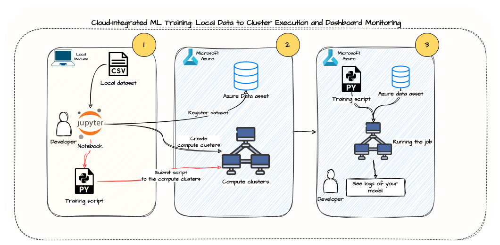
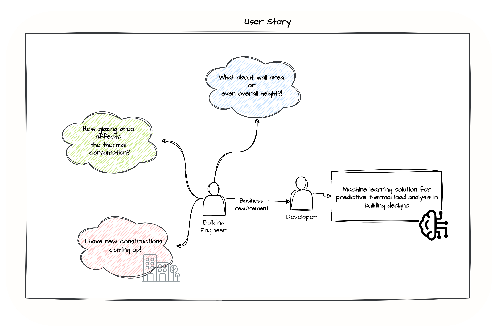

# Cloud-Integrated ML Training: Local Data to Cluster Execution and Dashboard Monitoring

## Overview

This repository showcases an Azure-based machine learning workflow. It demonstrates the process of uploading a dataset to Azure, setting up a machine learning environment with compute clusters, and running a Python script for model training and evaluation in the cloud. The project uses the Energy Efficiency Dataset to predict the thermal load of buildings, serving as a practical example of handling and analyzing data in a cloud environment.

The repository is structured to guide users through setting up their Azure Machine Learning environment, managing data, executing training scripts on Azure compute clusters, and monitoring performance metrics through MLFlow. It is designed to be a template for similar machine learning tasks, emphasizing the ease and efficiency of cloud-based data science workflows.

Key aspects of this repository include:

- Azure Machine Learning environment setup and configuration.
- Data upload and management in Azure.
- Execution of machine learning scripts on Azure compute clusters.
- Performance tracking and evaluation using MLFlow.

This project is ideal for those looking to understand how to leverage cloud platforms like Azure for machine learning tasks, from data handling to model deployment.

## Dataset

We use the Energy Efficiency Dataset, originally curated by Angeliki Xifara and Athanasios Tsanas at the University of Oxford, UK. It consists of 768 samples and 8 features, simulating different building shapes to predict thermal load. The dataset is in CSV format and is incorporated into our workspace for machine learning purposes.

## Attribute Information:

X1: Relative Compactness
X2: Surface Area
X3: Wall Area
X4: Roof Area
X5: Overall Height
X6: Orientation
X7: Glazing Area
X8: Glazing Area Distribution
y1: Heating Load
y2: Cooling Load

## Workflow

1. **Data Reading**: A Jupyter notebook reads data from a local machine.
2. **Data Upload and Registration**: The dataset is uploaded and registered into Azure as `URI_FILE`.
3. **Compute Cluster Creation**: The workflow includes steps to create ML compute clusters in Azure.
4. **Model Training Script**: A Python script (`train-model-script.py`) is provided for model training. Key functions in the script include:
   - `get_data()`: Reads the data.
   - `split_data()`: Splits the data into training and testing sets.
   - `train_model()`: Trains the model using a RandomForestRegressor.
   - `eval_model()`: Evaluates the model using metrics like RMSE and R-squared.
5. **MLFlow Integration**: We use MLFlow for logging metrics during model training and evaluation.

##Execution
To run the project:

1. **Azure ML Environment Setup**: Ensure your Azure Machine Learning environment is correctly configured with the necessary compute clusters. This includes providing your Azure subscription ID, resource group, and workspace name.
2. **Data Handling**: Execute the provided Jupyter notebook to manage data upload and registration. This step involves uploading the dataset to your Azure workspace.
3. **Model Training**: Use the command job in the Python notebook to execute the `train-model-script.py` script. This script will run on the Azure compute clusters, allowing for efficient model training and evaluation.
4. **Performance Monitoring**: Track the performance metrics of your model through MLFlow, which can be accessed via your ML Studio Dashboard.

## Objective

The main goal of this project is to demonstrate how to upload a dataset to Azure and execute a script on compute clusters. While the focus is on the practical application of these steps using a building dataset for thermal load prediction, the project serves as a template for a broader range of machine learning studies. This approach can be adapted to different datasets and machine learning scenarios, showcasing the versatility and power of Azure's ML tools and infrastructure.

Below can be a user story relevant to this repos, where we have a building dataset.

## Dependencies

This project relies on several libraries and packages for its execution. Ensure that these dependencies are installed in your environment:

- `IPython.display`: For displaying outputs in Jupyter notebooks.
- `azure.ai.ml.entities`: For using Azure ML entities like AmlCompute.
- `azure.ai.ml`: Core Azure Machine Learning library for Python.
- `azure.identity`: For Azure identity management and authentication.
- `azure.ai.ml.constants`: For accessing Azure ML constants like AssetTypes and InputOutputModes.
- `mlflow`: For experiment tracking and logging metrics.
- `argparse`: For parsing command-line arguments in Python scripts.
- `pandas`: For data manipulation and analysis.
- `numpy`: For numerical computations and array handling.
- `sklearn.model_selection`: For splitting datasets into training and test sets.
- `sklearn.pipeline`: For creating machine learning pipelines.
- `sklearn.preprocessing`: For data preprocessing and scaling.
- `sklearn.ensemble`: For ensemble machine learning models, specifically RandomForestRegressor.
- `sklearn.metrics`: For calculating performance metrics like mean squared error and R-squared.

These dependencies are crucial for the various stages of the project, from data processing and model training to evaluation and logging.

# Note

This project serves as a template for machine learning applications in energy efficiency and can be extended or modified for related tasks in the domain.
